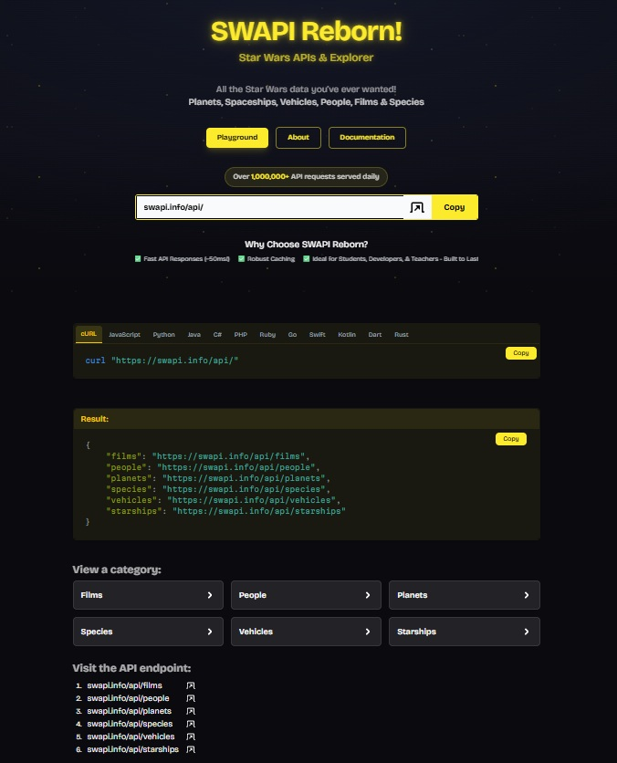
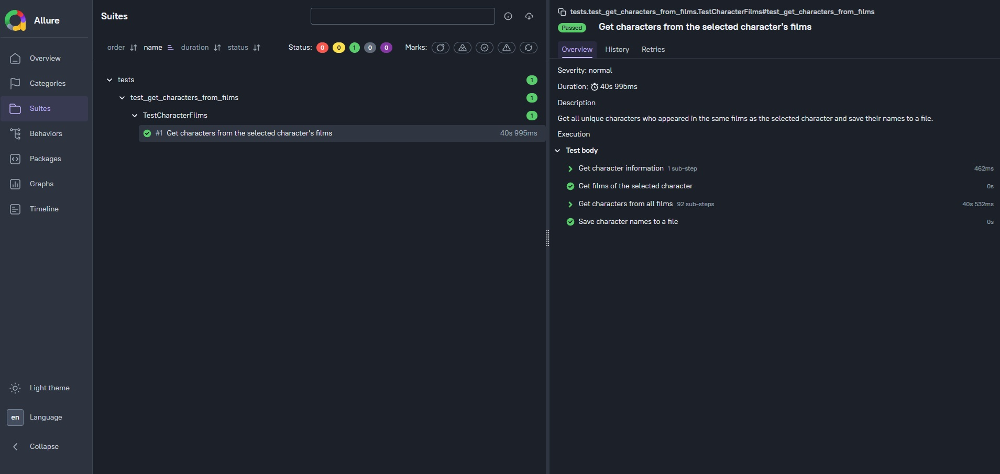

# API Autotests Project

API autotests written in Python using Pytest and Requests.

The project is based on practical tasks from the Stepik course and demonstrates a simple approach to API test automation with reusable API methods, logging and Allure reporting.

---

## Project features

- API testing with `Requests`
- Test execution with `Pytest`
- Reusable API methods
- Separation of test scenarios and API requests
- HTTP status code validation
- JSON response processing
- Working with multiple related API requests
- Removing duplicate data with Python `set`
- Saving test results to a text file
- API request and response logging
- Allure test reporting
- Allure titles, descriptions and steps

---

## API

The project uses [SWAPI](https://swapi.info/) — a Star Wars API.


Base URL:

```text
https://swapi.info/api
```

Example request:

```text
GET https://swapi.info/api/people/4
```

The request returns information about Darth Vader, including the films in which he appeared.

---

## Test scenario

### Get characters from the selected character's films

The main test uses Darth Vader as the default character:

```text
Character ID: 4
Character: Darth Vader
```

The test performs the following steps:

1. Get information about the selected character.
2. Get the list of films in which the character appeared.
3. Get information about each film.
4. Get all characters who appeared in those films.
5. Remove duplicate character names.
6. Sort the character names.
7. Save the result to a text file.

The test is written so that it can be reused for another character by changing the configuration values in the test.

---

## Project structure

```text
stepikEducationSwapi/
│
├── logs/
│   └── log_YYYY-MM-DD_HH-MM-SS.log
│
├── tests/
│   └── test_get_characters_from_films.py
│
├── utils/
│   ├── logger.py
│   └── swapi.py
│
├── .gitignore
├── pytest.ini
├── requirements.txt
└── README.md
```

### `tests`

Contains test scenarios.

`test_get_characters_from_films.py` contains the test for getting characters who appeared in the same films as the selected character.

### `utils/swapi.py`

Contains reusable methods for working with SWAPI.

The class provides methods for:

- getting a character by ID;
- getting film information;
- getting a character by URL.

### `utils/logger.py`

Contains methods for logging API requests and responses.

The logger records:

- test name;
- request time;
- HTTP method;
- request URL;
- response status code;
- response body;
- response headers;
- response cookies.

Log files are stored in the `logs` directory.

### `pytest.ini`

Contains Pytest configuration, including the configuration used for generating Allure results.

---

## Tech stack

     

---

## Installation

### 1. Clone the repository

```bash
git clone https://github.com/AlexanderOsipkin/stepikEducationSwapi.git
cd stepikEducationSwapi
```

### 2. Create a virtual environment

```bash
python -m venv .venv
```

Activate the virtual environment.

#### Windows

```powershell
.venv\Scripts\activate
```

#### macOS / Linux

```bash
source .venv/bin/activate
```

### 3. Install dependencies

```bash
pip install -r requirements.txt
```

---

## Run tests

Run all tests:

```bash
pytest -sv
```

The `-s` option allows `print()` output to be displayed in the console.

---

## Allure Report

The project uses `allure-pytest` to generate test results and Allure Report to display them.


Run tests and generate Allure results:

```bash
pytest -sv --alluredir=allure-results
```

Generate and open the Allure report:

```bash
allure serve allure-results
```

The `allure-results` directory contains temporary test results and should not be committed to the repository.

---

## Logging

API requests and responses are logged during test execution.

Each test run creates a log file with a timestamp:

```text
logs/
└── log_2026-09-XX_XX-XX-XX.log
```

The log contains information about requests and responses and can be used to investigate failed tests and analyze API behavior.

---

## Test flow

```text
Selected character
        ↓
Get character information
        ↓
Get character's films
        ↓
Get film information
        ↓
Get characters from each film
        ↓
Remove duplicate characters
        ↓
Sort character names
        ↓
Save names to a text file
        ↓
Allure Report + API logs
```

---

## Example

For Darth Vader, the test first gets his film list:

```text
GET /people/4
```

Then it requests each film and gets the list of characters from every film.
All character names are collected into a `set` to remove duplicates and are then sorted alphabetically before being saved to a text file.

---